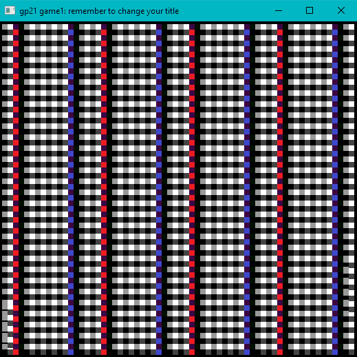

# (TODO: your game's title)

Author: Hridayesh Joshi

Design: Note, the game is incomplete due to some bugs I could not resolve in time. 
I drew inspiration from Pong for this game. However, there are two sliding barriers on the left and right side of the screen that are color coded. Additionally, the "balls" that spawn will also be color coded and it corresponds to which side of the screen the ball must exit. 

Screen Shot:

How Your Asset Pipeline Works:

I drew the assets myself using this website: https://www.pixilart.com/draw. That way I could ensure that all my assets could fit on an 8x8 tile perfectly. I added a method to
the PlayMode class: translateAsset. It takes in a vector of data that is supposed to 
correspond to the colors at each pixel. The goal is for all assets that needed to be added 
to the PPU, I would first call load_png, extract the 'data' vector, then call translateAsset with it. translateAsset also takes in a tile and pallette index that can be stored. The function extracts the colors out of the 'data' array and then sets the correct values of the pallette and tile tables given the argument. Once these are loaded, the sprites are ready to be drawn in by the PPU. 

Assets:

How To Play:

Again, the game is incomplete. All that can be done is speed up the two bars on the left and right side. I have some coloring issues with the background that make it a little confusing, but it should still be visible. How the game is supposed to work is that blocks will spawn in the middle and traverse in random directions, and they can bounce off the top and bottom walls. The blocks are color coded blue and red. If the block is blue, then you want to make sure it doesn't get through the side with the blue sliding barrier (left side) and vice versa. The point of the game is to last as long as you can without letting this happen. You get 3 lives. 

This game was built with [NEST](NEST.md).

